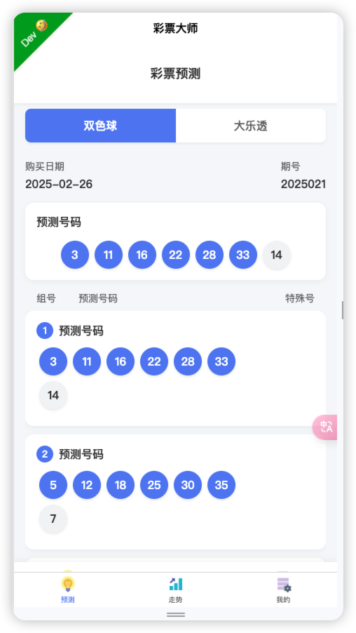
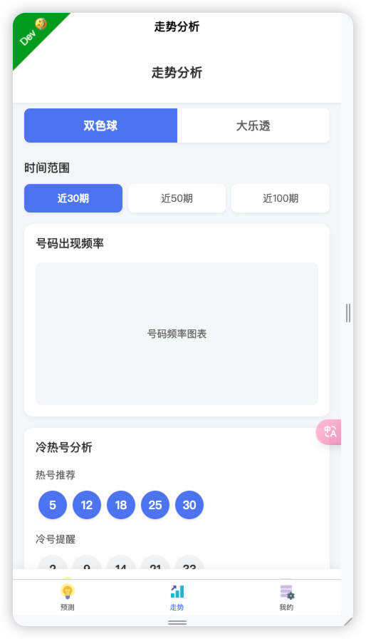
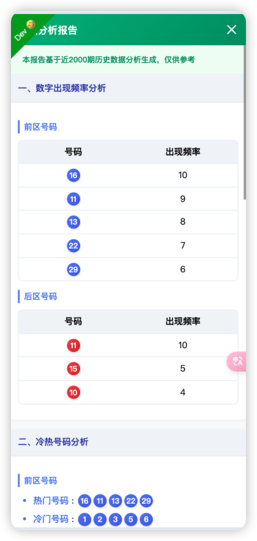
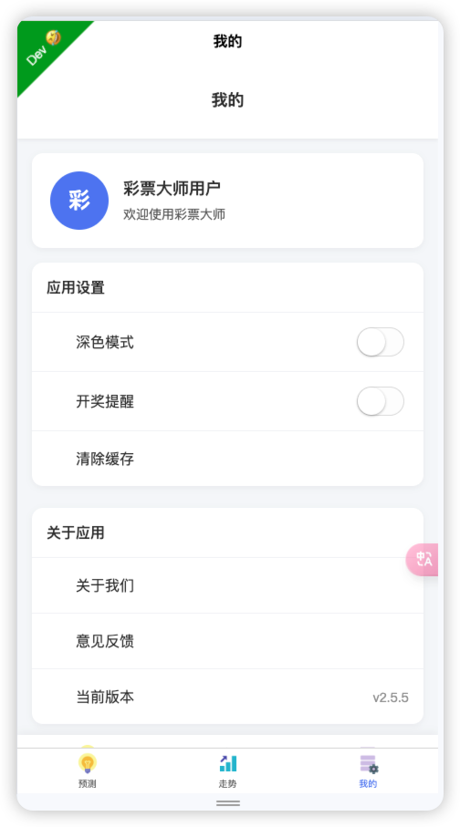

# 彩票大师 (Lottery Master)

彩票大师是一款现代化的彩票分析应用，支持双色球和大乐透两种彩票类型的数据分析和预测。应用提供了直观的用户界面，包括历史趋势分析和与中奖号码的比较功能。

## 功能特点

- 支持双色球和大乐透两种彩票类型
- 智能预测号码功能
- 历史走势分析
- 冷热号分析
- 历史记录查看

## 技术栈

- uniapp + Vue3 + TypeScript
- Vite 构建工具
- Pinia 状态管理
- SCSS 样式处理
- UnoCss 原子化 CSS
- Wot Design Uni UI 组件库

## 功能预览

### 预测功能



### 走势分析



### 分析报告



### 个人中心



## 项目结构

```
src/
├── components/         # 组件目录
│   ├── BottomNavBar.vue       # 底部导航栏组件
│   ├── LotteryHeader.vue      # 顶部导航栏组件
│   ├── LotteryNumberBall.vue  # 号码球组件
│   ├── LotteryPredictionSet.vue # 预测号码组件
│   └── LotteryTypeSwitch.vue  # 彩票类型切换组件
├── pages/              # 页面目录
│   ├── index/          # 首页 (预测页面)
│   ├── trends/         # 走势分析页面
│   └── my/             # 个人设置页面
├── pages-sub/          # 子页面目录
│   └── history/        # 历史记录页面
├── store/              # 状态管理
│   ├── index.ts        # Store 入口
│   ├── lottery.ts      # 彩票数据 Store
│   ├── theme.ts        # 主题 Store
│   └── user.ts         # 用户 Store
├── style/              # 样式目录
├── utils/              # 工具函数
└── App.vue             # 应用入口
```

## API 集成点

- 双色球数据抓取: `/api/scrape/ssq`
- 大乐透数据抓取: `/api/scrape/dlt`
- 双色球预测分析: `/api/analyze/ssq`
- 大乐透预测分析: `/api/analyze/dlt`

## 安装与运行

1. 安装依赖

```bash
pnpm install
```

2. 开发模式运行

```bash
# H5
pnpm dev:h5

# 微信小程序
pnpm dev:mp-weixin

# App
pnpm dev:app
```

3. 构建

```bash
# H5
pnpm build:h5

# 微信小程序
pnpm build:mp-weixin

# App
pnpm build:app
```

## 设计规范

应用遵循现代化的设计规范，包括：

- 亮色/暗色主题支持
- 圆形号码球设计
- 卡片式布局
- 响应式设计，适配不同尺寸的设备

## 贡献指南

欢迎提交 Issue 或 Pull Request 来改进这个项目。

## 致谢

感谢 [unibest](https://github.com/codercup/unibest) 提供的优秀模版，确实很好用！

## 许可证

MIT
